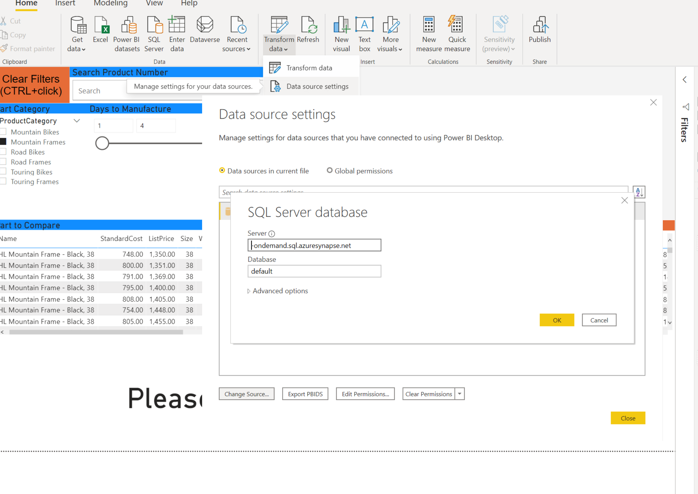
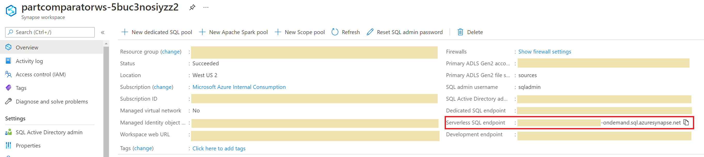

# Deployment Guide

Before starting deployment, you need to check your az cli version in your command window.

        az version

```json
{
  "azure-cli": "2.22.1",
  "azure-cli-core": "2.22.1",
  "azure-cli-telemetry": "1.0.6",
  "extensions": {
    "powerbidedicated": "0.2.0",
    "subscription": "0.1.4"
  }
}
```

we do recoomend to install updated version az cli before starting.  If you need to install or update Azure CLI, You start from [here]([http://](https://docs.microsoft.com/en-us/cli/azure/install-azure-cli))
  
## Step 1. Download Sources and Data
To start, clone or download this repository


## Step 2. Setup Resources and Data
Open your PowerShell console window with 'Run as Administrator'
and Set up Execution Policy with this command

        Set-ExecutionPolicy -ExecutionPolicy RemoteSigned

Navigate deployment folder under downloaded root foler with PowerShell console.  
In Deployment folder, execute [deploy.ps1](deployment/deploy.ps1) powershell script with 3 parameters - azure subscription ID, deploying region and SQl password for your sql pool instance.

        .\deploy.ps1
        

The deployment script sets up your Synapse Analytics environment with ADLS and then uploading raw datasets after creating filesystem in ADLS.

After couple of minutes, you may get the message that deployment has been completed like below
```
Select subscription 'XXXXX-2dee-4f11-a030-af9877a27492'
Switched subscription to 'XXXXXXXX-2dee-4f11-a030-af9877a27492'
This is userobject ID  XXXXXXXX-5191-4cee-aa0a-a96b14420f8c
Resource Deployment has been completed
Upload Dataset in Azure Data Lake source filesystem in XXXXXadls
Finished[#############################################################]  100.0000%
[
  {
    "Blob": "https://XXXXXadls.blob.core.windows.net/sources/Comparator SA Dataset.csv",
    "Last Modified": "2021-04-27T18:56:43+00:00",
    "Type": "application/vnd.ms-excel",
    "eTag": "\"0x8D909AE32CABAB6\""
  }
]
Whole Deployment process has been done
```

## Step 3. Upload Noteboks
1. Launch the Synapse workspace (via Azure portal > Synapse workspace > Workspace web URL) 
2. Go to `Develop`, click the `+`, and click `Import` to select all Spark notebooks from the repository's `/src/notebooks` folder
3. For each of the notebooks, select `Attach to > sparkpool1` in the top dropdown
4. Update `account_name` variable to your ADLS in the [Comparator - Data Preparation.ipynb](./src/notebooks/Comparator%20-%20Data%20Preparation.ipynb) notebook
5. Publish your all imported notebooks so they are saved in your workspace
6. Run the following notebooks in order:
    - [Comparator - Data Preparation.ipynb](./src/notebooks/Comparator%20-%20Data%20Preparation.ipynb)
    - [Comparator - Modeling.ipynb](./src/notebooks/Comparator%20-%20Modeling.ipynb)  
  
After running two notebooks, the compart similarity calculations finished and the results will be stored in SQL Shared Pool Database.

 

## Step 4. Explore Insights
Visualize the personalized recommendations using a Power BI dashboard:
1. Download [Power BI Desktop](https://www.microsoft.com/en-us/download/details.aspx?id=58494)
2. Open the [reports/PartComparator.pbix](./reports/PartComparator.pbix) file
3. Cancel the Refresh pop-up since the data source needs to be updated
4. Click `Transform data > Data source settings > Change Source...` from the top menu

      
5. Update the Server field with your `Serverless SQL endpoint` which can be found within `Azure > Synapse workspace > Overview`.

      
6. Keep database as `default` and click `OK`

# Congratulations
You have completed this solution accelerator and should now have a report to explore the Spare Part Comparator:

  

